# Implementation Plan: C++ 常见缺陷检测器 MVP

**Workspace**: `csa-defect-checkers` | **Date**: 2026-03-17 | **Spec**: [spec.md](spec.md)  
**Input**: Feature specification from `specs/csa-defect-checkers/spec.md`

---

## Summary

基于 llvm-project-personal（Clang 23.0.0git）开发 7 种 C++ 缺陷检测能力。分两条技术路线：已有 CSA Checker 验证 + 新建 CSA Checker（路径敏感，数学函数域检查），以及新建 clang-tidy Check（AST 模式匹配，大局部变量 / 浮点等号比较）。按 US1→US2→US3→US4 顺序推进，US1 为学习阶段，US2 为核心开发，US3/US4 批量完成。

---

## Technical Context

| 项目 | 值 |
|------|-----|
| **Language/Version** | C++17（LLVM/Clang 源码本身）；待检测目标程序为 C/C++ |
| **Primary Dependencies** | LLVM 23.0.0git, Clang, clang-tools-extra |
| **Build System** | CMake 3.x + Ninja |
| **Storage** | N/A |
| **Testing** | LLVM FileCheck + llvm-lit（集成测试）；手工示例程序（验证测试） |
| **Target Platform** | macOS (arm64), Xcode Command Line Tools SDK |
| **Project Type** | 编译器工具链扩展（single project, 本地构建） |
| **Performance Goals** | 新增 Checker 不应使单文件分析时间增长超过 5% |
| **Constraints** | 增量编译仍需数分钟；clang-tidy 尚未编译，首次构建约 10–20 分钟 |

---

## Architecture Overview

```mermaid
graph TD
    subgraph "User Story 1 & 2 — CSA Path"
        SRC1[C++ 源文件] --> CLANG[clang++ --analyze]
        CLANG --> PP[预处理 + 解析]
        PP --> AST1[AST]
        AST1 --> CFG1[CFG 构建]
        CFG1 --> EG[ExplodedGraph 符号执行]
        EG --> CHECKER_REG[Checker 调度]
        CHECKER_REG --> EXIST[已有 Checker: DivZero / NullDeref / ArrayBound]
        CHECKER_REG --> NEW_CSA[新建 Checker: MathDomainChecker]
        EXIST --> REPORT[BugReporter 输出告警]
        NEW_CSA --> REPORT
    end

    subgraph "User Story 3 & 4 — clang-tidy Path"
        SRC2[C++ 源文件] --> TIDY[clang-tidy]
        TIDY --> AST2[AST 解析]
        AST2 --> MATCHER[AST Matcher 引擎]
        MATCHER --> CHECK_STACK[bugprone-large-stack-variable]
        MATCHER --> CHECK_FLOAT[bugprone-float-equal-comparison]
        CHECK_STACK --> DIAG[诊断输出]
        CHECK_FLOAT --> DIAG
    end
```



**两条路线互不干扰**：CSA Checker 修改在 `clang/lib/StaticAnalyzer/Checkers/` 下；clang-tidy Check 修改在 `clang-tools-extra/clang-tidy/bugprone/` 下。各自独立编译、独立注册、独立测试。

---

## Key Design Decisions

### Decision 1: 数学函数域检查器使用 `alpha.security` 包注册

- **背景**: 新 Checker 需要一个 CSA 包名，影响用户启用方式
- **选项**:
  - A: `alpha.core.MathDomain` — 放在 core 包下，强调"核心运算"
  - B: `alpha.security.MathDomain` — 放在 security 包下，强调"安全隐患"
- **结论**: 选 B。数学函数域错误（sqrt 负数、asin 越界）导致 NaN/undefined behavior，属安全类缺陷。`alpha.` 前缀表示实验性，符合新 Checker 定位
- **后果**: 用户需 `-analyzer-checker=alpha.security.MathDomain` 显式启用

### Decision 2: clang-tidy Check 统一放 `bugprone` 模块

- **背景**: 两个 clang-tidy Check 需选择所属模块
- **选项**:
  - A: 分散到不同模块（`bugprone` + `readability`）
  - B: 统一放 `bugprone`
- **结论**: 选 B。大局部变量栈溢出和浮点等号比较都属于"可能导致 bug"的模式，语义上契合 `bugprone`；且只需修改一个模块的注册文件
- **后果**: 检查名称为 `bugprone-large-stack-variable` 和 `bugprone-float-equal-comparison`

### Decision 3: 使用 `add_new_check.py` 脚手架生成 clang-tidy Check

- **背景**: clang-tidy 有官方脚手架工具，可自动生成 `.h/.cpp`、更新 `CMakeLists.txt` 和模块注册
- **选项**:
  - A: 手动创建所有文件
  - B: 用 `add_new_check.py` 生成骨架后再填充逻辑
- **结论**: 选 B。减少手动配置出错概率，确保与 LLVM 项目结构一致
- **后果**: 需要 Python 3 环境（已安装）

---

## Module Design

### Module: MathDomainChecker（CSA Checker — US2）

**职责**: 检测 `sqrt`/`asin`/`acos` 等数学函数的参数是否超出定义域

**注册位置**: `Checkers.td` → `let ParentPackage = SecurityAlpha in { ... }`  
**全名**: `alpha.security.MathDomain`

**接口（继承结构）**:

```
class MathDomainChecker : public Checker<check::PreCall>
  // 在函数调用发生前检查参数

  BugType BT_Sqrt   {"MathDomainChecker", "sqrt of negative value",    ...}
  BugType BT_InvTrig{"MathDomainChecker", "inverse trig domain error", ...}

  void checkPreCall(const CallEvent &Call, CheckerContext &C) const
```

**核心流程**:

```
checkPreCall(Call, C):
  1. 获取被调用函数的 IdentifierInfo
  2. 匹配函数名: sqrt / sqrtf / sqrtl / asin / asinf / acos / acosf ...
  3. 获取第一个参数的 SVal（符号值）
  4. 根据函数类型确定合法域:
     - sqrt 系列: arg >= 0
     - asin/acos 系列: -1 <= arg <= 1
  5. 用 ConstraintManager 检查当前路径状态下参数是否可能违反域约束:
     - assume(arg >= 0) 是否可行 → 可行则不报
     - assume(arg < 0) 是否可行 → 可行则报警
  6. 若违反: 创建 BugReport，附带路径诊断信息
  7. 若无法判断（符号值约束不足）: 不报（宁可漏报不误报）
```

> **决策**: 使用 `check::PreCall` 而非 `check::PostCall`，因为需要在函数执行前检查参数合法性，类似于前置条件检查。

> **风险**: 当前源码中 `DivZeroChecker` 已迁移至 `CheckerFamily<...>` 模式（替代旧的 `Checker<...>`）。实现 MathDomainChecker 时需以实际源码为准——若 `Checker<check::PreCall>` 模板仍可用则直接使用，否则需改用 `CheckerFamily` 模式。US1 的源码笔记（T012）应明确记录当前 API 模式。

> **决策**: 匹配函数名时同时匹配 C 标准库名（`sqrt`）和 C++ `std::` 版本（`std::sqrt`），覆盖 `<cmath>` 和 `<math.h>` 两种用法。

**关键 API 调用**:

```
// 获取参数符号值
SVal ArgVal = Call.getArgSVal(0);

// 尝试约束: 参数 < 0?
ProgramStateRef StateNeg = State->assume(IsNegative, true);
ProgramStateRef StateNonNeg = State->assume(IsNegative, false);

// 如果 StateNonNeg 为空（参数必定为负），则报警
if (!StateNonNeg && StateNeg) {
    报告 BugReport
}
```

---

### Module: LargeStackVariableCheck（clang-tidy — US3）

**职责**: 检测函数内局部变量（尤其是大数组）占用栈空间过大

**注册名称**: `bugprone-large-stack-variable`  
**所属模块**: `clang-tools-extra/clang-tidy/bugprone/`

**接口**:

```
class LargeStackVariableCheck : public ClangTidyCheck
  unsigned Threshold = 1048576  // 默认 1MB，可通过选项配置

  void registerMatchers(MatchFinder *Finder)
  void check(const MatchFinder::MatchResult &Result)
  void storeOptions(ClangTidyOptions::OptionMap &Opts)
```

**核心流程**:

```
registerMatchers:
  1. 匹配所有函数体内的 VarDecl（局部变量声明）
     Finder->addMatcher(
       varDecl(hasLocalStorage()).bind("var"),
       this
     )

check:
  1. 获取绑定的 VarDecl 节点
  2. 获取变量类型的 TypeInfo（通过 ASTContext::getTypeInfo）
  3. 计算变量大小（字节）= TypeSize / 8
  4. 若大小 >= Threshold:
     diag(变量位置, "局部变量 '%0' 占用 %1 字节栈空间，超过阈值 %2")
  5. 特殊处理:
     - VLA（VariableArrayType）: 无法确定大小，单独警告
     - alloca() 调用: 匹配 CallExpr 到 alloca，警告不可控的栈分配
```

> **决策**: 默认阈值 1MB (1048576 bytes)，通过 `LargeStackVariableThreshold` 选项可配置。嵌入式场景用户可能设为更小值（如 64KB）。

---

### Module: FloatEqualComparisonCheck（clang-tidy — US4）

**职责**: 检测对浮点数使用 `==` 或 `!=` 进行比较

**注册名称**: `bugprone-float-equal-comparison`  
**所属模块**: `clang-tools-extra/clang-tidy/bugprone/`

**接口**:

```
class FloatEqualComparisonCheck : public ClangTidyCheck
  void registerMatchers(MatchFinder *Finder)
  void check(const MatchFinder::MatchResult &Result)
```

**核心流程**:

```
registerMatchers:
  1. 匹配二元运算符 == 或 !=，其中至少一个操作数为浮点类型
     Finder->addMatcher(
       binaryOperator(
         anyOf(hasOperatorName("=="), hasOperatorName("!=")),
         hasEitherOperand(hasType(realFloatingPointType()))
       ).bind("binop"),
       this
     )

check:
  1. 获取绑定的 BinaryOperator 节点
  2. 排除 NaN 惯用写法: 如果是 x != x 形式（LHS 和 RHS 引用同一 DeclRefExpr），跳过
  3. 排除宏展开内的比较（可选，减少噪音）
  4. diag(运算符位置, "浮点数不应使用 %0 进行比较，建议使用容差比较")
```

> **决策**: `x != x` 是检测 NaN 的标准惯用写法（等价于 `std::isnan(x)`），不应报警。通过比较 LHS 和 RHS 是否引用同一变量来排除。

> **决策**: 此 Check 同时适用于 C 和 C++ 程序。浮点等号比较问题在两种语言中均存在，`isLanguageVersionSupported` 不做语言限制。

---

## Project Structure

### Documentation（本功能产物）

```text
specs/csa-defect-checkers/
├── spec.md              # 功能规格 (specify 输出)
├── plan.md              # 本文件 (plan 输出)
├── tasks.md             # 任务列表 (tasks 输出，下一步)
└── checklists/
    └── requirements.md  # 检查清单
```

### Source Code（需新增/修改的文件）

```text
llvm-project-personal/
├── clang/
│   ├── include/clang/StaticAnalyzer/Checkers/
│   │   └── Checkers.td                          # [修改] 添加 MathDomain Checker 注册
│   └── lib/StaticAnalyzer/Checkers/
│       ├── CMakeLists.txt                        # [修改] 添加 MathDomainChecker.cpp
│       └── MathDomainChecker.cpp                 # [新建] 数学函数域检查 Checker
│
├── clang-tools-extra/clang-tidy/bugprone/
│   ├── CMakeLists.txt                            # [修改] 添加两个 Check 的 .cpp
│   ├── BugproneTidyModule.cpp                    # [修改] 注册两个新 Check
│   ├── LargeStackVariableCheck.h                 # [新建] 大局部变量检查头文件
│   ├── LargeStackVariableCheck.cpp               # [新建] 大局部变量检查实现
│   ├── FloatEqualComparisonCheck.h               # [新建] 浮点等号比较检查头文件
│   └── FloatEqualComparisonCheck.cpp             # [新建] 浮点等号比较检查实现
│
└── testProgram/                                  # 测试示例程序
    ├── demo.cpp                                  # [已有] 除以零 + 空指针
    ├── test_divide_zero.cpp                      # [新建] 除以零边界用例
    ├── test_null_deref.cpp                       # [新建] 空指针解引用边界用例
    ├── test_array_bound.cpp                      # [新建] 数组越界边界用例
    ├── test_math_domain.cpp                      # [新建] sqrt/asin/acos 域检查用例
    ├── test_large_stack_var.cpp                   # [新建] 大局部变量栈溢出用例
    └── test_float_equal.cpp                      # [新建] 浮点等号比较用例
```

**文件统计**:

| 类型 | 数量 |
|------|------|
| 新建源文件（.h + .cpp） | 5 个 |
| 修改已有文件 | 4 个 |
| 新建测试程序 | 6 个 |
| **总计** | 15 个文件 |

**Structure Decision**: 遵循 LLVM 项目现有目录结构约定。CSA Checker 源文件直接放在 `Checkers/` 顶层（与 `DivZeroChecker.cpp` 同级）；clang-tidy Check 放在对应模块目录下（与同模块的其他 Check 同级）。测试程序统一放在 `testProgram/` 下，按缺陷类型命名。

---

## Design Artifacts

| 产物 | 条件 | 本次是否生成 |
|------|------|-------------|
| research.md | Technical Context 有 NEEDS CLARIFICATION | 否 — 技术栈已确定 |
| data-model.md | 涉及数据存储 | 否 — N/A |
| contracts/openapi.yaml | 涉及 API 接口 | 否 — N/A |
| quickstart.md | 需要本地开发指南 | 否 — 环境已在前序对话中配置完毕 |

---

## Notes

### 构建注意事项

1. **clang-tidy 首次构建**: 当前 `build-csa/bin/` 中已有 `clang++` 和 `clangd`，但 `clang-tidy` 尚未编译。US3/US4 开始前需运行 `ninja clang-tidy`，预计首次编译 10–20 分钟
2. **增量编译**: 修改单个 Checker `.cpp` 后，`ninja clang` 增量编译约 1–3 分钟；修改 `Checkers.td` 会触发 TableGen 重新生成，额外增加 1–2 分钟
3. **macOS SDK 路径**: 运行 `clang++ --analyze` 需显式传入 `-isysroot "$(xcrun --show-sdk-path)"` 和 `-I"$(xcrun --show-sdk-path)/usr/include/c++/v1"`

### 风险

1. **US2 复杂度**: MathDomainChecker 需要正确使用 `ConstraintManager::assume()` API 处理符号值约束，这是 CSA 最核心也最难调试的部分。若遇到困难，可先实现仅匹配字面量常量（如 `sqrt(-1.0)`）的简化版本，再逐步扩展到符号值
2. **API 变动**: llvm-project main 分支的 API 可能与文档/教程中描述的旧版 API 不完全一致（如 `CheckerFamily` 替代了旧的 `Checker` 基类模式），需以当前源码为准
3. **clang-tidy 构建依赖**: 确认 `LLVM_ENABLE_PROJECTS` 已包含 `clang-tools-extra`（已确认包含）

### 已确认的前提条件

- [x] CMake + Ninja 已安装
- [x] `build-csa` 目录已配置，`clang++` 和 `clangd` 可用
- [x] `LLVM_ENABLE_PROJECTS=clang;clang-tools-extra`
- [x] `compile_commands.json` 已链接到仓库根目录
- [x] Cursor clangd 已配置可跳转

### 下一步

运行 `tasks` 命令，将本 plan 拆解为具体的可执行任务列表（tasks.md），按 User Story 分 Phase 逐步实施。
