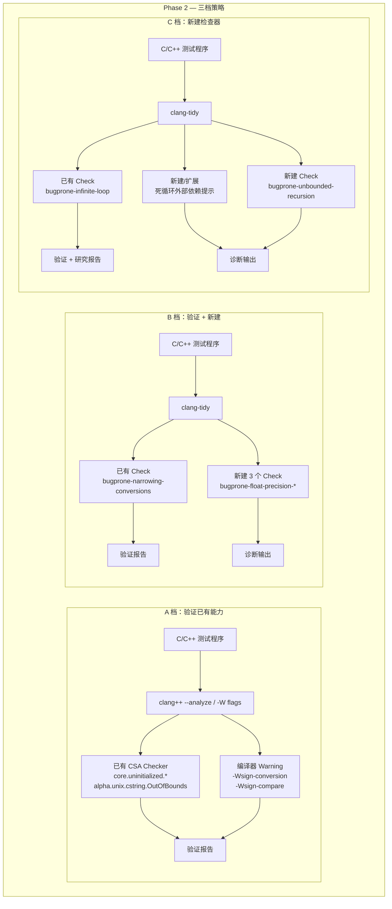

# Implementation Plan: C++ 缺陷检测器 Phase 2

**Workspace**: `csa-phase2-defects` | **Date**: 2026-03-17 | **Spec**: [spec.md](spec.md)
**Input**: Feature specification from `specs/csa-phase2-defects/spec.md`

---

## Summary

基于 llvm-project-personal（Clang 23.0.0git）完成剩余 10 种 C++ 缺陷的检测能力。按三档推进：A 档（6 种）验证已有 CSA Checker / 编译器 warning 并编写测试文档；B 档（2 种）验证已有 clang-tidy check 覆盖并新建 3 个浮点精度检查器；C 档（2 种）在已有 `bugprone-infinite-loop` 基础上扩展死循环检测，并新建递归栈溢出检查器。

---

## Technical Context

| 项目 | 值 |
|------|-----|
| **Language/Version** | C++17（LLVM/Clang 源码本身）；待检测目标程序为 C/C++ |
| **Primary Dependencies** | LLVM 23.0.0git, Clang, clang-tools-extra |
| **Build System** | CMake 3.x + Ninja |
| **Storage** | N/A |
| **Testing** | 手工示例程序（验证测试）+ LLVM FileCheck/llvm-lit（可选） |
| **Target Platform** | macOS (arm64), Xcode Command Line Tools SDK |
| **Project Type** | 编译器工具链扩展（single project, 本地构建） |
| **Performance Goals** | 新增 Check 不应使单文件分析时间增长超过 5% |
| **Constraints** | 增量编译仍需数分钟；US2 的 alpha Checker 仅验证不增强 |

---

## Architecture Overview



---

## Key Design Decisions

### Decision 1: US6 死循环 — 复用已有 `bugprone-infinite-loop` 而非从零构建

- **背景**: 调研发现 clang-tidy 已有 `bugprone-infinite-loop` 检查，使用 `ExprMutationAnalyzer` 和 `CallGraph` 检测循环条件变量未在循环体中修改的情况
- **选项**:
  - A: 忽略已有检查，完全新建一个 CSA Checker
  - B: 先验证已有检查的覆盖，再新建补充检查覆盖"外部依赖提示"场景
- **结论**: 选 B。已有 `bugprone-infinite-loop` 覆盖了核心场景（条件恒真、条件变量未修改），新建补充检查只需关注"循环退出依赖外部调用"的提示功能
- **后果**: 减少重复工作；新检查命名为 `bugprone-loop-external-dependency` 以区别于已有检查

### Decision 2: US5 浮点精度 — 3 个独立 clang-tidy Check 统一放 `bugprone` 模块

- **背景**: Spec 要求对精度提升、精度丢失、字面量后缀缺失分别创建独立检查器
- **选项**:
  - A: 3 个独立 Check，各自独立注册
  - B: 1 个 Check 内部用选项控制 3 种模式
- **结论**: 选 A。独立 Check 更清晰，用户按需启用，且符合 clang-tidy 的一个 Check 一个关注点的惯例
- **后果**: 需要在 `bugprone` 模块注册 3 个新 Check：`bugprone-float-precision-promotion`、`bugprone-float-precision-loss`、`bugprone-float-literal-suffix`

### Decision 3: US7 递归检测 — 基于 AST CallGraph 的 clang-tidy Check

- **背景**: Clang 提供 `clang/Analysis/CallGraph.h` AST 级调用图，可检测直接和间接递归
- **选项**:
  - A: CSA Checker（路径敏感，可分析递归终止条件）
  - B: clang-tidy Check（AST 级，检测递归结构但不做路径分析）
- **结论**: 选 B。递归检测的核心是调用图结构分析（是否有环），不需要路径敏感能力；clang-tidy 可直接使用 `CallGraph` API
- **后果**: 新建 `bugprone-unbounded-recursion`，利用 `CallGraph` + `SCCIterator` 检测调用图中的环，再分析环中函数的终止条件

---

## Module Design

### Module: US1 验证 — core.uninitialized.* 测试套件

**职责**: 编写覆盖 6 个已有 `core.uninitialized.*` Checker 的测试程序，运行分析并记录结果

**已有 Checker 清单**:

```
core.uninitialized.ArraySubscript — 未初始化值用作数组下标
core.uninitialized.Assign         — 赋值未初始化值
core.uninitialized.Branch         — 未初始化值用作分支条件
core.uninitialized.CapturedBlockVariable — Block 捕获未初始化变量
core.uninitialized.UndefReturn    — 返回未初始化值
core.uninitialized.NewArraySize   — new[] 数组大小未初始化
```

**核心流程**:

```
1. 为每个 Checker 编写测试程序（正例/反例/边界）
2. 运行 clang++ --analyze 并收集输出
3. 对照 Acceptance Scenarios 判定通过/未通过
4. 生成 US1 验证报告
```

---

### Module: US2 验证 — alpha.unix.cstring.OutOfBounds 测试套件

**职责**: 验证 alpha CString Checker 对 strcpy/strcat/memcpy/memset 越界的检测覆盖

**已有 Checker**: `alpha.unix.cstring.OutOfBounds`（依赖 `CStringModeling`）

**核心流程**:

```
1. 编写 4 组测试: strcpy 越界、strcat 越界、memcpy 不足、memset 不足
2. 每组包含: 必定越界（应检出）、安全调用（不应报）、边界值
3. 运行 clang++ --analyze -Xanalyzer -analyzer-checker=alpha.unix.cstring.OutOfBounds
4. 记录检出/未检出场景
5. 对未检出场景标记为 Known Limitation
6. 生成 US2 验证报告
```

> **决策**: 仅验证记录，不增强 alpha Checker。alpha Checker 由 LLVM 社区维护，修改风险高。

---

### Module: US3 验证 — 编译器 Warning 测试套件

**职责**: 验证 `-Wsign-conversion` 和 `-Wsign-compare` 对整数符号类缺陷的检测

**核心流程**:

```
1. 编写测试程序: 无符号赋负值、有符号/无符号比较、安全场景
2. 运行 clang++ -fsyntax-only -Wsign-conversion -Wsign-compare
3. 记录告警输出
4. 生成 US3 验证报告
```

> **决策**: 使用 `-fsyntax-only` 模式 — 只做语法/语义分析，不生成目标文件，高效且足够。

---

### Module: US4 验证 — bugprone-narrowing-conversions 评估

**职责**: 验证已有 `bugprone-narrowing-conversions` 对浮点转整数溢出的覆盖范围

**已有 Check**: `bugprone-narrowing-conversions`（文件 `NarrowingConversionsCheck.cpp`）

**核心流程**:

```
1. 编写测试: double→int、float→short、安全方向转换、显式 cast
2. 运行 clang-tidy -checks='-*,bugprone-narrowing-conversions'
3. 记录覆盖/未覆盖场景
4. 如有不足: 评估增强可行性，决定是否新建补充 Check
5. 生成 US4 评估报告
```

---

### Module: FloatPrecisionPromotionCheck（clang-tidy — US5 检查器 A）

**职责**: 检测 `float` 变量参与 `double` 运算（隐式精度提升）

**注册名称**: `bugprone-float-precision-promotion`
**所属模块**: `clang-tools-extra/clang-tidy/bugprone/`

**核心流程**:

```
registerMatchers:
  匹配 binaryOperator（算术运算）,
  其中一个操作数为 float 类型，另一个为 double 类型（或整个表达式提升为 double）

check:
  1. 获取两个操作数的类型
  2. 如果一个是 float 另一个是 double（或 double 字面量）→ 报告
  3. 排除: printf 等可变参数函数中的自动提升（C 标准行为）
  4. 排除: 显式 cast
```

---

### Module: FloatPrecisionLossCheck（clang-tidy — US5 检查器 B）

**职责**: 检测 `double` 值赋给 `float` 变量或传给 `float` 参数（精度丢失）

**注册名称**: `bugprone-float-precision-loss`
**所属模块**: `clang-tools-extra/clang-tidy/bugprone/`

**核心流程**:

```
registerMatchers:
  匹配 implicitCastExpr(hasImplicitDestinationType(asString("float")),
                         hasSourceExpression(hasType(asString("double"))))
  匹配 varDecl(hasType(asString("float")),
               hasInitializer(hasType(asString("double"))))

check:
  1. 获取源表达式和目标类型
  2. 如果是 double → float 隐式转换 → 报告
  3. 排除: 显式 static_cast<float>(d)
  4. 排除: 常量表达式中精度无损的情况（如 0.0）
```

---

### Module: FloatLiteralSuffixCheck（clang-tidy — US5 检查器 C）

**职责**: 检测 `float` 上下文中使用无 `f` 后缀的浮点字面量

**注册名称**: `bugprone-float-literal-suffix`
**所属模块**: `clang-tools-extra/clang-tidy/bugprone/`

**核心流程**:

```
registerMatchers:
  匹配 floatLiteral().bind("lit")
  在 implicitCastExpr(hasImplicitDestinationType(asString("float"))) 上下文中

check:
  1. 获取 FloatingLiteral 节点
  2. 检查字面量是否为 double 类型（无 f 后缀的字面量默认为 double）
  3. 检查上下文: 赋值给 float 变量、传给 float 参数、参与 float 运算
  4. 如果字面量是 double 且上下文期望 float → 报告，建议加 f 后缀
  5. 排除: 0.0（精度无损）
```

---

### Module: LoopExternalDependencyCheck（clang-tidy — US6）

**职责**: 检测循环退出条件依赖外部函数调用的情况，输出提示性 warning

**注册名称**: `bugprone-loop-external-dependency`
**所属模块**: `clang-tools-extra/clang-tidy/bugprone/`

**与已有 `bugprone-infinite-loop` 的关系**:

```
bugprone-infinite-loop (已有):
  → 检测循环条件变量未在循环体中被修改
  → 检测 while(true) 无 break/return
  → 使用 ExprMutationAnalyzer + CallGraph

bugprone-loop-external-dependency (新建):
  → 检测循环退出条件依赖外部函数调用（可能导致死循环）
  → 输出提示性 warning（非错误）
  → 不与 infinite-loop 重叠
```

**核心流程**:

```
registerMatchers:
  匹配 whileStmt / forStmt / doStmt，绑定条件表达式

check:
  1. 获取循环条件表达式
  2. 扫描条件中的所有 DeclRefExpr → 收集条件变量集合
  3. 扫描循环体:
     a. 条件变量的修改是否仅通过外部函数调用（callExpr 赋值）?
     b. 条件本身是否是外部函数调用 (如 while(getStatus()))?
  4. 如果条件变量的值完全依赖外部调用 → 报提示 warning
  5. 排除: volatile 变量（硬件场景）
  6. 排除: 条件变量在循环体中有直接赋值（非函数调用）
```

---

### Module: UnboundedRecursionCheck（clang-tidy — US7）

**职责**: 检测无终止条件或终止条件不可达的递归调用；对终止条件依赖外部输入的递归给出提示

**注册名称**: `bugprone-unbounded-recursion`
**所属模块**: `clang-tools-extra/clang-tidy/bugprone/`

**核心流程**:

```
1. 使用 CallGraph 构建当前翻译单元的调用图
2. 使用 SCCIterator 遍历强连通分量（SCC），找到所有递归环
3. 对每个递归环中的函数:

   a. 检查函数体是否包含终止条件:
      - 扫描所有 returnStmt
      - 判断 return 是否在条件分支中（ifStmt / switchStmt 等）
      - 如果无条件 return 在递归调用之前 → 有终止条件
      - 如果完全没有 return 或 return 在递归调用之后 → 无终止条件

   b. 分类报告:
      - 无终止条件 → ERROR: "函数存在无条件递归调用"
      - 终止条件依赖外部函数调用 → WARNING: "递归终止取决于外部调用"
      - 间接递归环（多个函数互调） → WARNING: "检测到间接递归环路: A → B → A"
      - 有终止条件且条件变量随递归参数递减 → 正常，不报

4. 排除: 函数指针/回调（无法静态解析调用目标）
```

> **决策**: 使用 `clang::CallGraph` + `llvm::scc_iterator`，这是 Clang 已有的 AST 级调用图基础设施，`bugprone-infinite-loop` 已经在使用它。

---

## Project Structure

### Documentation（本功能产物）

```text
specs/csa-phase2-defects/
├── spec.md              # 功能规格 (specify 输出)
├── plan.md              # 本文件 (plan 输出)
├── tasks.md             # 任务列表 (tasks 输出，下一步)
└── checklists/
    └── requirements.md  # 检查清单
```

### Source Code（需新增/修改的文件）

```text
llvm-project-personal/
│
├── clang-tools-extra/clang-tidy/bugprone/
│   ├── CMakeLists.txt                                # [修改] 添加 5 个新 Check
│   ├── BugproneTidyModule.cpp                        # [修改] 注册 5 个新 Check
│   │
│   │  -- US5: 浮点精度 --
│   ├── FloatPrecisionPromotionCheck.h                # [新建]
│   ├── FloatPrecisionPromotionCheck.cpp              # [新建]
│   ├── FloatPrecisionLossCheck.h                     # [新建]
│   ├── FloatPrecisionLossCheck.cpp                   # [新建]
│   ├── FloatLiteralSuffixCheck.h                     # [新建]
│   ├── FloatLiteralSuffixCheck.cpp                   # [新建]
│   │
│   │  -- US6: 死循环扩展 --
│   ├── LoopExternalDependencyCheck.h                 # [新建]
│   ├── LoopExternalDependencyCheck.cpp               # [新建]
│   │
│   │  -- US7: 递归检测 --
│   ├── UnboundedRecursionCheck.h                     # [新建]
│   └── UnboundedRecursionCheck.cpp                   # [新建]
│
├── testProgram/
│   ├── test_uninitialized.cpp                        # [新建] US1 测试
│   ├── test_cstring_bounds.cpp                       # [新建] US2 测试
│   ├── test_sign_conversion.cpp                      # [新建] US3 测试
│   ├── test_narrowing_conversion.cpp                 # [新建] US4 测试
│   ├── test_float_precision_promotion.cpp            # [新建] US5-A 测试
│   ├── test_float_precision_loss.cpp                 # [新建] US5-B 测试
│   ├── test_float_literal_suffix.cpp                 # [新建] US5-C 测试
│   ├── test_loop_external_dep.cpp                    # [新建] US6 测试
│   └── test_unbounded_recursion.cpp                  # [新建] US7 测试
│
└── docs/
    ├── phase2-us1-uninitialized-report.md             # [新建] US1 验证报告
    ├── phase2-us2-cstring-bounds-report.md             # [新建] US2 验证报告
    ├── phase2-us3-sign-warnings-report.md              # [新建] US3 验证报告
    ├── phase2-us4-narrowing-report.md                  # [新建] US4 评估报告
    ├── phase2-us6-infinite-loop-research.md             # [新建] US6 研究报告
    └── phase2-us7-recursion-research.md                # [新建] US7 研究报告
```

**文件统计**:

| 类型 | 数量 |
|------|------|
| 新建源文件（.h + .cpp） | 10 个 |
| 修改已有文件 | 2 个 |
| 新建测试程序 | 9 个 |
| 新建文档/报告 | 6 个 |
| **总计** | 27 个文件 |

**Structure Decision**: 遵循 LLVM 项目和 Phase 1 已有的目录结构约定。所有新 clang-tidy Check 放在 `bugprone` 模块下（与 Phase 1 一致）。验证报告放在 `docs/` 下。

---

## Design Artifacts

| 产物 | 条件 | 本次是否生成 |
|------|------|-------------|
| research.md | Technical Context 有 NEEDS CLARIFICATION | 否 — 技术栈已确定 |
| data-model.md | 涉及数据存储 | 否 — N/A |
| contracts/openapi.yaml | 涉及 API 接口 | 否 — N/A |
| quickstart.md | 需要本地开发指南 | 否 — Phase 1 已配置完毕 |

---

## Notes

### 实施顺序建议

```
Phase A（验证类，可并行）:
  US1 未初始化变量 ─┐
  US2 缓冲区越界   ─┤→ 编写测试 + 运行分析 + 生成报告
  US3 整数符号     ─┤
  US4 浮点转整数   ─┘

Phase B（新建类，可并行）:
  US5-A 精度提升 Check     ─┐
  US5-B 精度丢失 Check     ─┤→ 脚手架生成 + 编写逻辑 + 编译 + 测试
  US5-C 字面量后缀 Check   ─┘

Phase C（复杂类，顺序）:
  US6 死循环（先验证 infinite-loop，再新建补充 Check）
  US7 递归检测（新建 Check + 研究报告）

Phase D（收尾）:
  汇总所有报告 → Phase 2 完成报告
  编译全量回归测试
```

### 风险

1. **US2 alpha Checker 可能未覆盖部分场景**: `alpha.unix.cstring.OutOfBounds` 是实验性的，可能对某些 memcpy/memset 场景不够精确。根据 clarify 结论，仅记录为 Known Limitation。
2. **US5 浮点精度检查的误报**: `float` 与 `double` 的隐式转换在 C/C++ 中极其常见，检查器需要精心设计排除规则以控制误报（如可变参数提升、0.0 字面量等）。
3. **US6 与已有 `bugprone-infinite-loop` 的边界**: 需要仔细验证已有检查覆盖了哪些场景，新建补充 Check 不能与其产生重复告警。
4. **US7 调用图局限性**: `CallGraph.h` 是 AST 级的调用图，无法解析函数指针和虚函数调用。间接递归检测限于静态可解析的调用。
5. **编译时间**: 新增 5 个 clang-tidy Check，首次编译 `ninja clang-tidy` 可能需要 5-10 分钟；后续增量编译 1-3 分钟。

### 工时估计

| Phase | 内容 | 估计 |
|-------|------|------|
| A | US1-US4 验证 + 测试 + 报告 | 4-6 小时 |
| B | US5 三个浮点精度 Check | 6-8 小时 |
| C | US6 死循环扩展 + US7 递归检测 | 8-12 小时 |
| D | 收尾 + 回归测试 + 报告 | 2-3 小时 |
| **总计** | | **约 3-4 个工作日** |

### 已确认的前提条件

- [x] CMake + Ninja 已安装
- [x] `build-csa` 目录已配置，`clang++` 和 `clang-tidy` 可用
- [x] `LLVM_ENABLE_PROJECTS=clang;clang-tools-extra`
- [x] `compile_commands.json` 已链接到仓库根目录
- [x] Phase 1 MVP + 增强已全部完成并提交
- [x] `bugprone-infinite-loop` 和 `bugprone-narrowing-conversions` 已存在可验证
- [x] `CallGraph.h` 调用图基础设施可用

### 下一步

运行 `tasks` 命令，将本 plan 拆解为具体的可执行任务列表（tasks.md）。
